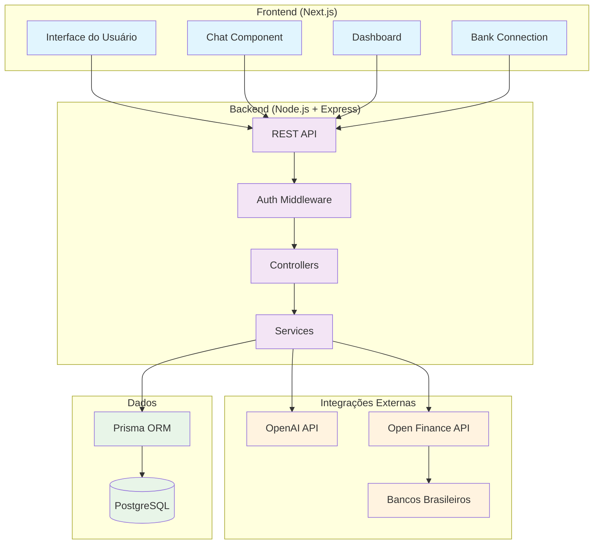
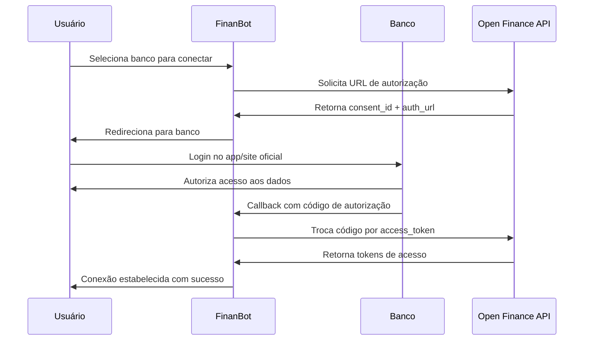
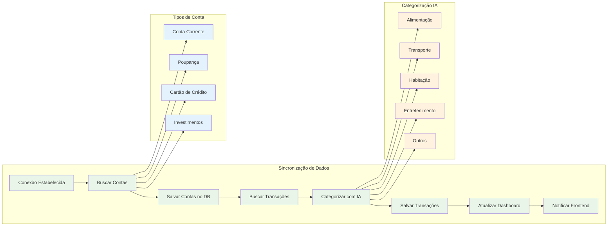
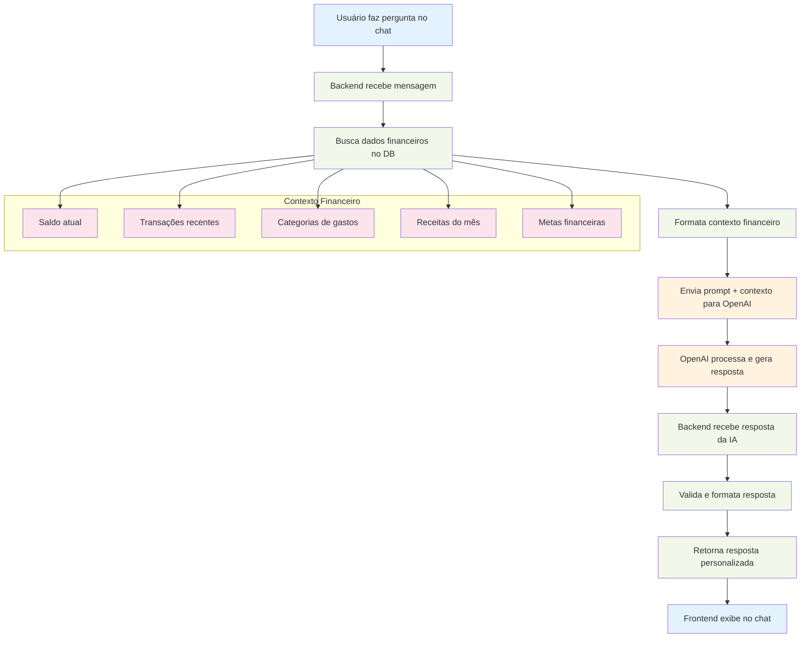

# 🤖 FinanBot - Assistente IA para Finanças Pessoais

FinanBot é uma plataforma completa que oferece uma experiência única para gerenciar suas finanças através de IA. Com integração direta ao Open Finance, você pode conversar com seu dinheiro de forma inteligente e obter insights personalizados.

## 🚀 Funcionalidades

- **💬 Chat com IA**: Converse sobre suas finanças em linguagem natural
- **🏦 Open Finance**: Integração segura com múltiplos bancos brasileiros
- **📊 Dashboard Inteligente**: Visualizações avançadas de gastos e receitas
- **🔍 Análise Automática**: Insights personalizados baseados em IA
- **📱 Interface Moderna**: Design responsivo e intuitivo
- **🔐 Segurança Total**: Conformidade com regulamentações bancárias

## 🛠️ Stack Tecnológica

### Backend
- **Node.js** + **TypeScript**
- **Express.js** - Framework web
- **Prisma** - ORM para banco de dados
- **PostgreSQL** - Banco de dados
- **JWT** - Autenticação
- **OpenAI API** - Integração de IA

### Frontend
- **Next.js 14** - Framework React
- **TypeScript** - Tipagem estática
- **Tailwind CSS** - Estilização
- **Shadcn/ui** - Componentes UI
- **Chart.js** - Gráficos e visualizações
- **Socket.io** - Chat em tempo real

## 🏗️ Estrutura do Projeto

```
finanbot/
├── backend/          # API e servidor
│   ├── src/
│   ├── prisma/
│   └── package.json
├── frontend/         # Interface do usuário
│   ├── src/
│   ├── components/
│   └── package.json
└── shared/          # Tipos e utilitários compartilhados
```

### 🏛️ **Arquitetura do Sistema**



## 🚀 Como Executar

### Desenvolvimento
```bash
# Setup inicial
./setup.sh

# Executar backend e frontend
npm run dev

# URLs:
# Frontend: http://localhost:3000
# Backend API: http://localhost:3001
# Prisma Studio: npm run db:studio
```

> 💡 O comando `npm run setup` executado pelo script de setup cria `backend/.env` a partir de `backend/env.example` quando o arquivo ainda não existe.
> Revise `backend/.env` e personalize `DATABASE_URL`, `JWT_ACCESS_SECRET`, `JWT_REFRESH_SECRET`, `OPENAI_API_KEY` e as variáveis `OPEN_FINANCE_*` antes de rodar `npm run dev`.

### Produção
```bash
# Configurar .env de produção
cp env.production .env
# Edite .env com suas credenciais

# Deploy completo
./deploy.sh

# URLs:
# Frontend: https://finanbot.com
# Backend API: https://api.finanbot.com
```

### Login Demo
- **Email**: demo@finanbot.com
- **Senha**: demo123456

## 🔗 Endpoints Open Finance

```bash
# Listar bancos disponíveis
GET /api/open-finance/banks

# Conectar banco
POST /api/open-finance/connect
{
  "institutionId": "itau"
}

# Visualizar conexões ativas  
GET /api/open-finance/connections

# Sincronizar contas
POST /api/open-finance/connections/:id/sync-accounts

# Sincronizar transações
POST /api/open-finance/accounts/:id/sync-transactions

# Revogar conexão
DELETE /api/open-finance/connections/:id
```

## 💬 Chat IA com Dados Reais

O diferencial do FinanBot é a **IA que conversa com seus dados financeiros reais**:

```
👤 "Como estão minhas finanças este mês?"

🤖 "Suas finanças estão organizadas! Você teve receita de R$ 3.500 
   e gastos de R$ 1.705, economizando R$ 1.795 (51.3%). 
   Seu maior gasto foi habitação (R$ 1.200)."

👤 "Onde posso economizar?"

🤖 "Analisando seus dados, você pode economizar R$ 150/mês 
   cancelando assinaturas não utilizadas e reduzindo 20% 
   dos gastos com delivery."
```

## 🔐 Como Funciona a Integração Open Finance

### 🔄 **Fluxo de Conexão Bancária**

O FinanBot implementa **OAuth 2.0 completo** conforme padrão Open Finance Brasil:



```typescript
// 1. Usuário escolhe banco (Itaú, Nubank, etc.)
POST /api/open-finance/connect { "institutionId": "itau" }

// 2. FinanBot gera URL de autorização segura
const authUrl = "https://api.openfinance.com/auth?consent_id=abc123..."

// 3. Redirecionamento para login no banco
// Usuário faz login no app/site oficial do banco

// 4. Banco autoriza e retorna código
GET /auth/callback?code=xyz789&consent_id=abc123

// 5. FinanBot troca código por tokens de acesso
POST /api/open-finance/exchange-code
```

### 📊 **Sincronização Automática**



```typescript
// Busca contas bancárias
GET /api/open-finance/connections/:id/sync-accounts
// → Conta corrente, poupança, cartão de crédito

// Sincroniza transações em tempo real
GET /api/open-finance/accounts/:id/sync-transactions
// → Últimas transações categorizadas pela IA
```

### 🤖 **Integração com IA Financeira**



```typescript
// IA analisa dados reais do Open Finance
const context = {
  totalBalance: 5250.75,
  monthlyIncome: 3500.00,
  monthlyExpenses: 1705.30,
  expensesByCategory: {
    "Alimentação": 409.90,
    "Habitação": 1200.00
  }
}

// Conversação inteligente baseada em dados reais
"Qual foi meu maior gasto este mês?"
→ "Seu maior gasto foi R$ 320 no restaurante japonês dia 15"
```

### 🏦 **Bancos Suportados**

**Principais Bancos Brasileiros:**
- **Itaú** (341) - Contas e cartões
- **Nubank** (260) - Conta digital e cartão
- **Bradesco** (237) - Produtos completos  
- **Banco do Brasil** (001) - Conta e investimentos
- **Santander** (033) - Contas e financiamentos
- **Caixa** (104) - Conta e FGTS
- **XP Banking** (348) - Investimentos
- **BTG Pactual** (208) - Private banking

### 🔒 **Segurança Open Finance**

✅ **Conformidade Total:**
- Certificação oficial Banco Central
- TLS 1.3 end-to-end encryption  
- Tokens com rotação automática
- Auditoria completa de acessos
- LGPD compliance nativo

✅ **Zero Senhas:**
- Nunca solicitamos senhas bancárias
- Login direto no banco oficial
- Tokens temporários e seguros
- Revogação instantânea pelo usuário

## 📝 Licença

MIT License - veja o arquivo LICENSE para detalhes.

---

Desenvolvido com ❤️ para revolucionar suas finanças pessoais 